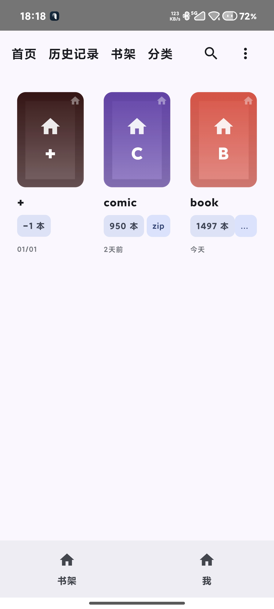
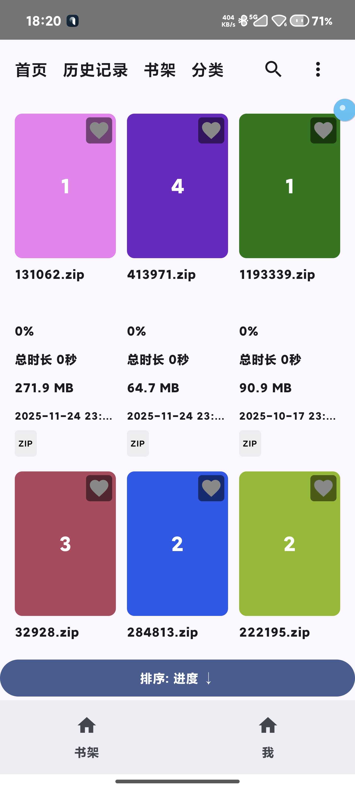

# 这是个本地看漫画的软件,纯属个人爱好,只保存正常阅读
1. ComicScreen app无法达到我的要求, 所以自己写了一个
# 使用
1. 下载安装
2. 初始密码 "111"
3. 进入书架,点击"+"进行添加.这里有两种方式
   4.  一种是扫描指定后缀文件, 比如zip. 这种方式需要所有权
   5. 一种是点击"添加目录",给定路径,路径里面的文件必须全部是图片类型, 比如jpg,png,jpeg,gif,这样才会添加成功
      6. 这是为了解压后的文件式的漫画
7. 点击添加后的书架,进入阅读.长按出现菜单,可以收藏,修改
# 注意事项
1. 没有删除选项
2. 第二,会出现软件比较大,因为我这里自动生成了ico图标,所以软件比较大
3. padding3 的重组会造成收藏漫画的时候出现下滑的现象.
4. 数据库查询那部分是我单独需要的,不用在意.
5. 如果zip文件时损坏的,app会崩溃的, 但是你可以把它隐藏掉, 长按弹出菜单,点击隐藏
# 展示

1. 这里我隐藏了图标,懂得懂得

# 遗憾
1. 第一没有阅读pdf之类的书籍,想完成,但是发现没必要.里面有些代码会遗留相关pdf阅读